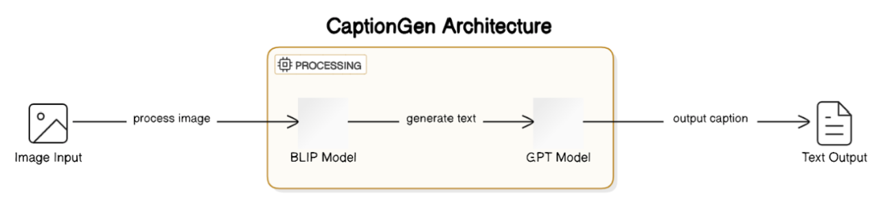

# CaptionGen
Author: **Dillon McCarthy**

---

## 🖥️ [CaptionGen Application](https://captiongen.streamlit.app/)

## 🎯 Introduction and Objective

**CaptionGen** is a multimodal AI application that generates creative, engaging captions for social media images.  Users upload an image, and the model analyzes its content to produce a post-ready caption.  This project is especially useful for:

- Small businesses seeking efficient content creation
- Personal brands aiming for consistency in tone
- Social media managers scaling frequent posts

By combining image analysis and natural language generation, CaptionGen streamlines the creative process while maintaining relevance and brand voice.

---

## 🧠 Generative AI Model Selection

CaptionGen leverages **Generative AI** in a two-step, multimodal pipeline:

1. **Image-to-Text (Image Captioning):**  
   - **Model:** [BLIP (Bootstrapped Language Image Pretraining)](https://huggingface.co/Salesforce/blip-image-captioning-base)  
   - **Why:** BLIP is one of the leading models for image captioning.  It provides strong visual understanding for diverse image types—ideal for real-world social media content.

2. **Text-to-Text (Creative Captioning):**  
   - **Models:**  
     - **GPT-4o:** Used via OpenAI API to transform concise captions into creative, human-like social media posts, including emoji use and brand-consistent tone.
     - **GPT-2:** Selected as an open-source model for fine-tuning experiments on social-style text generation.

---

## 📖 Project Definition and Use Case

The application targets social media users who require tailored captions; small businesses and personal brands in particular.  The BLIP vision-language model will be paired with the GPT large-language model to offer a simplified solution for generating social media posts.  There are many use cases for social media, but today it serves as one of the best marketing channels for many businesses.  Different platforms require different types of content, and maintaining consistent and frequent content can be challenging.  Not only that, but being creative with social media posts is what onboards consumers onto a product or service.

This project will offer custom social media content generation tailored to multiple platforms and styles.  By supplying an image with a platform type and predefined style, the application will output an appropriate caption.

| **Platform** | **Style**        |
|--------------|------------------|
| Instagram    | Engaging         |
| X (Twitter)  | Professional     |
| Facebook     | Funny            |

**Table 1**: CaptionGen input parameters

Other configurable parameters include:
- `temperature`
- `top_p`
- `max_output_tokens`

Users may also enable **One-Shot Captioning with CLIP**, an optional advanced feature that:
1. Generates 4 captions using different sampling techniques (greedy, beam search, top-k, top-p).
2. Embeds these using CLIP.
3. Selects the caption with the highest cosine similarity to the image embedding.

This feature boosts caption relevance and quality but increases inference time.

---

## 📂 Implementation Plan

### Libraries and Frameworks
- **Hugging Face Transformers**: Tokenization, model loading, and training
- **Hugging Face Datasets**: Efficient data access and preprocessing
- **PyTorch**: Model training and fine-tuning
- **PIL**: Image preprocessing
- **Streamlit**: Front-end web app development
- **OpenAI API**: Access to GPT-4o for enhanced captions

### Compute Resources
- **Google Colab**: short-term prototyping and experimenting with different models and training techniques
- **WPI Turing Cluster**: High-performance training on NVIDIA A100 GPUs

### Models
- **BLIP**:pre-trained image captioning model, fine-tuned on datasets
- **GPT-2**: pre-trained model open-sourced and fine-tuned on datasets
- **GPT-4o**: pre-trained multipurpose model accessed through API
- **CLIP**: pre-trained zero-shot transfer learning model

### Data Management
- **Parquet Format**: streaming subsets of data for manageability
- **Google Drive**: private storage for private dataset
- **Hugging Face**: central location for accessing large datasets

---

## ✍️ Design Process

### Develop
- Design model architecture
- Identify pretrained models
- Identify several datasets
- Fine-tune BLIP and GPT-2
- Develop back-end framework to load models
- Integrate back-end with CLIP
- Integrate back-end with OpenAI APIs for GPT-4o
- Add style prompts to GPTs
- Input/output text cleaning and processing

### Test
- Fine-tuned hyperparameters:
  - `epochs`, `learning_rate`, `batch_size`, `top_k`, `top_p`, `temperature`, `repetition_penalty`
- Conducted peer review and user testing
- Validated BLEU and ROUGE on BLIP outputs

---

## 📱 Model Evaluation and Performance Metrics

The application architecture is non-deterministic and has two independent components that could be evaluated.  This makes it challenging to evaluate the performance on specific metrics that are commonly used such as ROUGE and BLEU since these metrics require a reference dataset.  Nonetheless, BLIP was evaluated using unseen validation data from Obscure-Entropy/ImageCaptioning_SmallParquets to compute ROUGE and BLEU scores.

| **Metric**     | **Score** |
|----------------|-----------|
| ROUGE-1        | 0.2275    |
| ROUGE-2        | 0.1230    |
| ROUGE-L        | 0.1989    |
| ROUGE-Lsum     | 0.1988    |
| BLEU           | 0.0017    |

> These scores are low by conventional standards, but expected. The goal is **creative, diverse output**—not literal matches with reference captions.

**End-to-end quality** was instead assessed through human evaluation.  When evaluating the application on an end-to-end basis, the model performs extremely well.  The following are sample captions were generated on Streamlit:

**Strolling through paradise with my furry sidekicks! 🐾✨ Who's leading who? #DogAdventures #NatureBuddies**

**🌿✨ Dive into the garden vibes! Lush greens, sunshine, and smiles all around. Who's ready for some outdoor fun? 🌼🎉 #GardenParty #GoodVibes**

---

## 🚀 Deployment Strategy:
Streamlit offers its Community Cloud platform for hosting and sharing Streamlit applications.  Once CaptionGen was fully functioning locally, the deployment process was initiated to share the app.  Several steps were identified to deploy and publish the code:
1. Remove API key from code
2. Create BLIP and GPT models with their access token in Hugging Face
3. Upload BLIP and GPT tensor weights to Hugging Face using access token
4. Adjust code to use Hugging Face model instead of loading locally
5. Test loading model from Hugging Face with Streamlit
6. Upload remaining code to GitHub (Can’t store large files like the models)
7. Verify requirements.txt for Streamlit to install dependencies
8. Deploy new Streamlit App with GitHub repo and OpenAI secret
9. Monitor Streamlit Community Cloud App install all dependencies and build the app
10. Share the URL and let others start captioning their social media posts!

## ⛔ Expected Outcomes and Challenges:
Oftentimes in generative modeling applications one of the greatest challenges is access to GPUs for training and compute workloads; however, the limiting factor for this application was the data.  Originally it was expected that training and fine-tuning models for coherent and appropriate output would be challenging, but aggravated by the lack of high-quality, accessible, and manageable data for the use case.  For this project there were three opportunities for training:
Image to Long-Text: enhance image captioning to directly transform image weights into social media-worthy captions
Short-Text to Long-Text: enhance a short caption into a longer, more creative caption catered for social media
Image to Short-Text: enhance image captioning to more descriptively identify objects within images

The first approach would limit the loss of information when transforming images into text, and by fine-tuning on real social media images and captions the better results the model could produce.  Nonetheless, while many Twitter datasets exist, these are generally just text based.  Since visual datasets were needed, two were identified: Instagram Influencer Dataset and “takara-ai/image_captions” from Hugging Face.  The former was a private dataset with access granted from the researchers to a Google Drive containing ~200GB of image-caption pairs spanning 64 multipart zip files.  After several attempts to work with the dataset, including both Linux, Windows, and Python decompression tools, the multipart zips were unable to be loaded for training.  Similarly, for the Hugging Face dataset, the size proved challenging to work with and exceeded Google Colab’s disk size for the free tier.  Combined attempts to work with these datasets intermittently absorbed almost two weeks of development.
This left the second option: training a text-to-text model on enhancing a short caption into a longer, more creative caption for social media.  After heavy research, the Waterfront/social-media-captions was identified as an ideal match for the task.  This dataset contains 45,400 pairings of “human” and “assistant” captions, where the assistant expands upon the human caption to make it suitable for social media.  Unfortunately, despite various hyperparameters and fine-tuning techniques, the models did not evaluate well after training.  Captions generated were off topic and hallucinated objects or people, and included an excessive amount of hashtags.  The challenge here lay with the quality of the data itself, and without any images in the data, it seemed a lot of details were lost between the human and assistant captions.
This left the final option of enhancing a basic image captioning model with traditional image captioning datasets.  These are plentiful, but to capture the most details the Obscure-Entropy/ImageCaptioning_SmallParquets dataset was identified as a strong candidate to enhance BLIP’s captioning details.  The dataset contains 1.5 million small image-caption pairs at around 34GB, and many rows contain several adjectives and descriptive identifiers of objects in the image, something the pretrained BLIP model does not always capture.

## 🛠️ Resources Required:
The following lists the required resources for developing the project.
- Python, PyTorch, Hugging Face Transformers, Hugging Face Datasets
- Google Colab T4 GPU runtimes (free but limited)
- WPI Turing Cluster
- Streamlit
- OpenAI API Key (optional but recommended for best performance)

## 📸 Conclusion:
The application performs very well and quickly generates captions.  While it is challenging to evaluate without a defined target dataset, human evaluation shows that using the GPT-4o model with BLIP gives exceptional performance.  GPT-2 does not perform that well and does not always generate coherent or meaningful captions.  Despite the architecture of two pre-trained models, the inference time is strong and usable when running locally with around 5 seconds to generate a caption after the image is loaded.  Unfortunately, for a free web hosting service like Streamlit, one of the drawbacks is significant overhead for resources which aggravates inference times.  When generating a caption with Streamlit Community Cloud, end-to-end inference time takes closer to 30 seconds.

Altogether CaptionGen offers a streamlined method to rapidly generate creative captions for images with consistent styles.  GPT-4o integrates extremely well with the fine-tuned BLIP model and is highly recommended for use.  The application creatively engages readers through interesting captions, enhancing the visual storytelling experience and making content more compelling and relatable.  Whether for social media, marketing, or personal projects, CaptionGen ensures that each image is accompanied by a captivating and contextually relevant caption, elevating the overall impact of the visual content.
> Whether for businesses, content creators, or marketers, CaptionGen delivers a unique blend of automation and creativity—making every image post-ready with just one click.  Go see for yourself! [CaptionGen](https://captiongen.streamlit.app/)